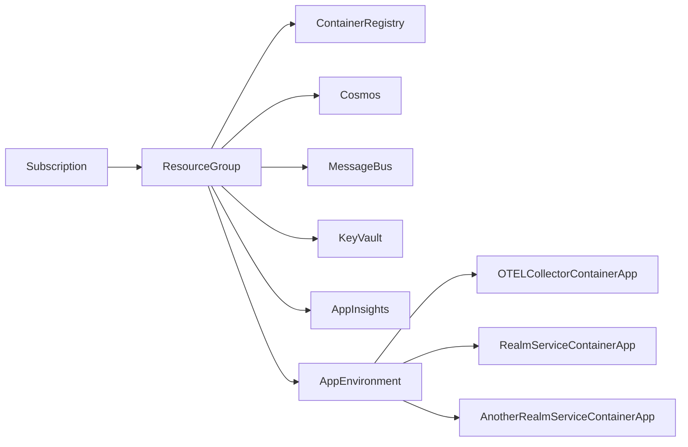
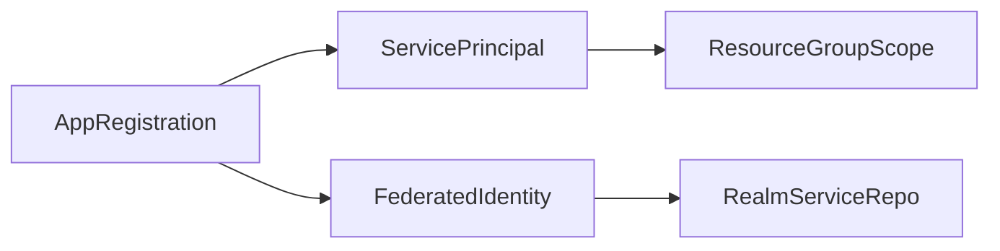

How To
======

Assume Existing Subscription
----------------------------

Have the subscription id ready, it will be needed.

`$sub = '{{guid}}'`

It will also be useful to know the tenant id.

`$tenant = '{{guid}}'`

Create the app registration
---------------------------

Create an app registration for the subscription named `Secure_DevOps`. This will be our 'super' DevOps user used to create application environments and nothing else.

We want that registration name in our scripts.

`$applicationRegistrationName = 'Secure_DevOps'`

This line can be used to create via the Azure CLI:

`az ad app create --display-name $applicationRegistrationName`

The output of the command contains things we need for later:

- Application ID (json property: appId)
- Object Id (json property: id)

`$applicationId = '{{from json}}'`

`$applicationRegistrationObjectId = '{{from json}}'`

Repositories
------------

#### Infrastructure

The infrastructure repository describes application deployment and platform resources for the whole of the system across all environments, including for each of the solutions that make it up.

Deployments only occur from the infrastructure repository workflows. Additional workflows exist to allow manually defining new environments.

#### Solution


Create Federated Credentials
----------------------------

We want to permit github actions to authenticate without having passwords in its configuration, so we use federated credentials.

Create a `policy.json` file as
```json
{
  "name": "{{MyFederatedCredential}}",
  "issuer": "https://token.actions.githubusercontent.com",
  "subject": "repo:{{github-org}}/{{repo-name}}:ref:refs/heads/{{branch-name}}",
  "audiences": [
    "api://AzureADTokenExchange"
  ]
}
```

- {{MyFederatedCredential}} is the name of credential. Can be simple, like 'MyAppNPFed'
- {{github-org}} is the github org, like 'optum-eeps'
- {{repo-name}} is the name of the repo
- {{branch-name}} is the name of the branch (master, or main usually)

`az ad app federated-credential create --id $applicationRegistrationObjectId --parameters policy.json`

Create a service principal
--------------------------

`az ad sp create --id $applicationId`

We need to determine the role for the principal, as well as the scope of its access. 'Contributor' is a common role. We can isolate the scope to the solution, or to a resource group. Here we use a subscription scope.

`az role assignment create --assignee $applicationId --role Contributor --scope "/subscriptions/$sub" --description "for ci/cd use"`

Github Actions Workflow
-----------------------

Specify:

```yaml
permissions:
  id-token: write
  contents: read
```

Add an az login step after the checkout:

```yaml
- uses: azure/login@v1
  with:
    client-id: ${{ secrets.AZURE_CLIENT_ID }}
    tenant-id: ${{ secrets.AZURE_TENANT_ID }}
    subscription-id: ${{ secrets.AZURE_SUBSCRIPTION_ID }}
```

Repository Secrets
------------------

Set secrets for the repository actions for
- AZURE_CLIENT_ID (from the $applicationId variable above)
- AZURE_TENANT_ID (from the $tenant variable above)
- AZURE_SUBSCRIPTION_ID (from the $sub variable above)

Notes
=====

Where Resource Group == 'Environment' (Test, Stage, Prod)



More
====

